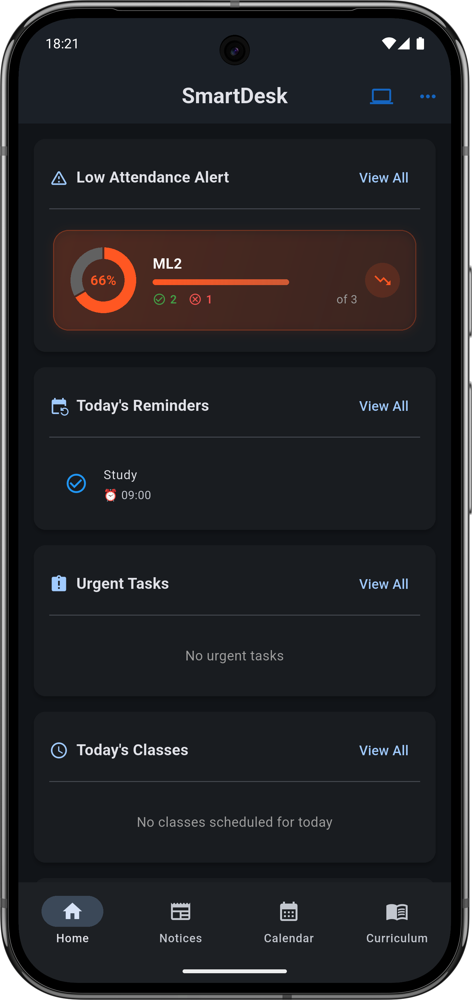
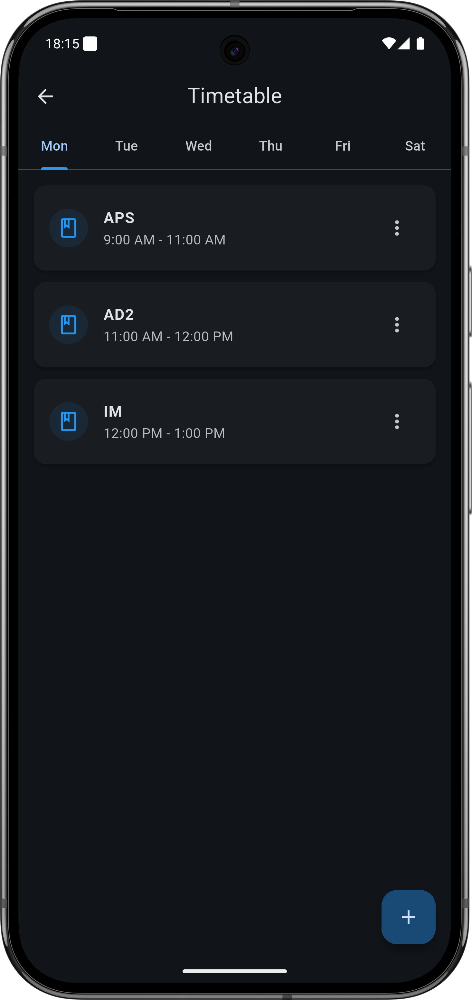
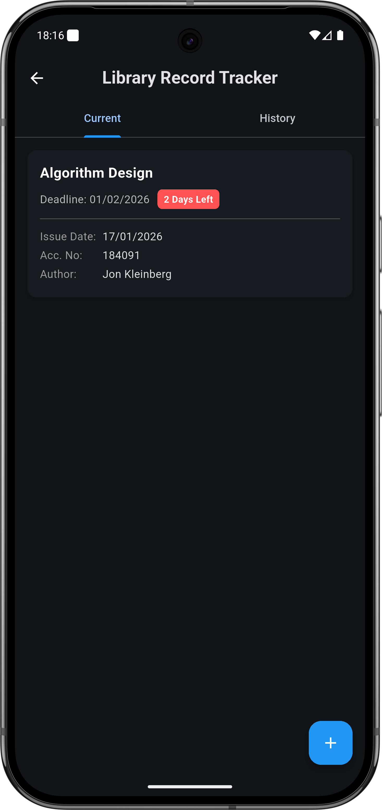
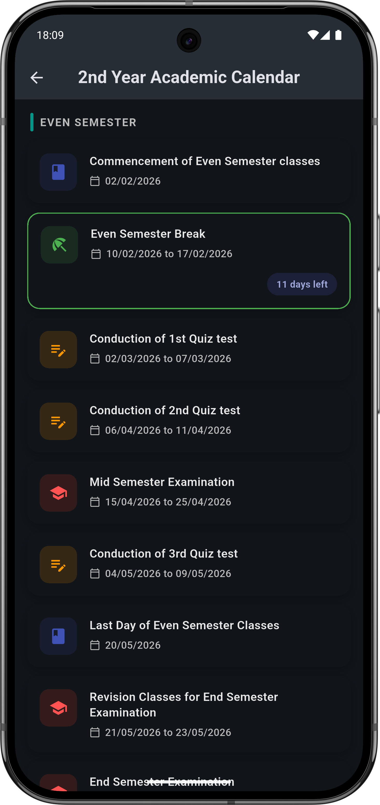
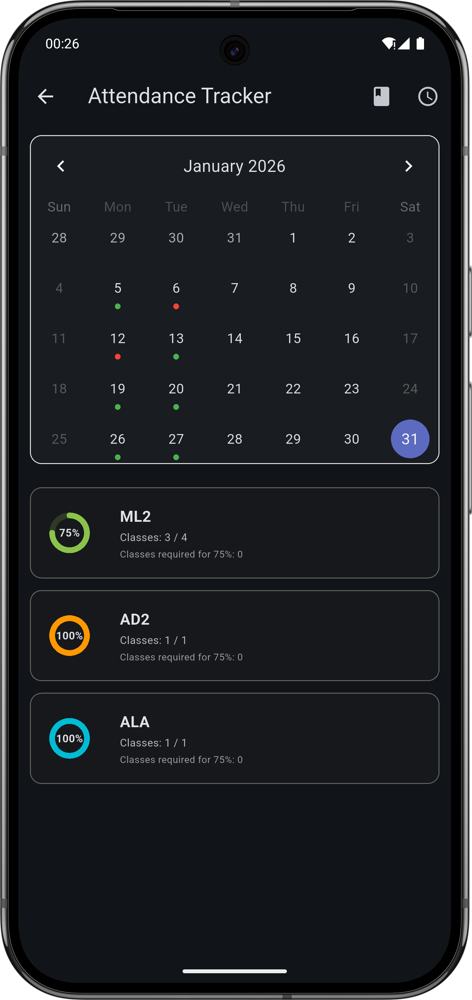
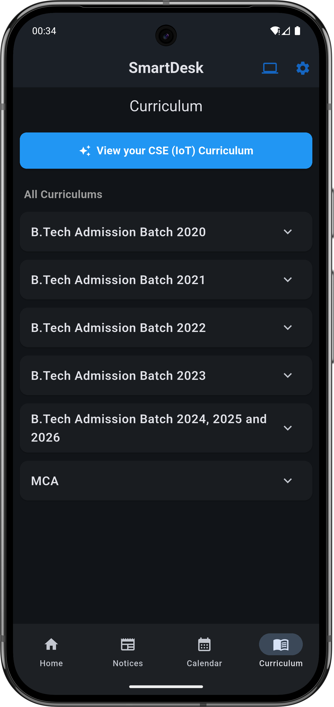
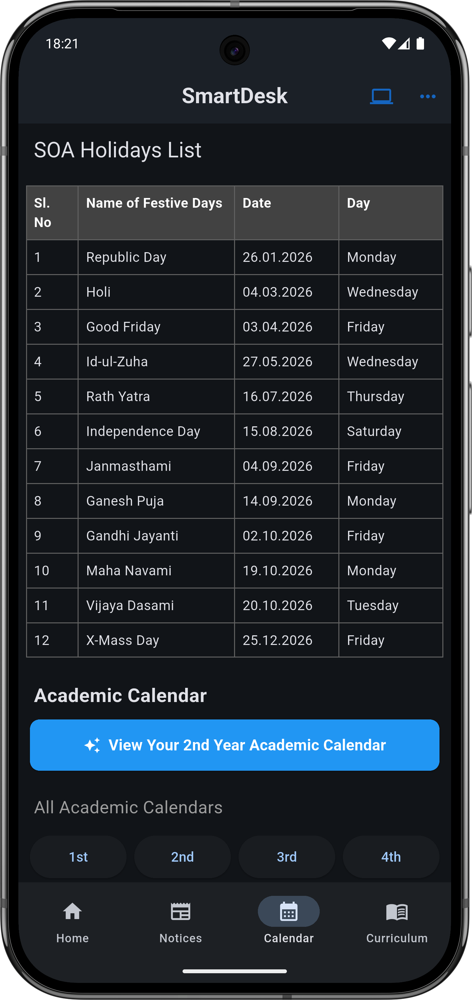
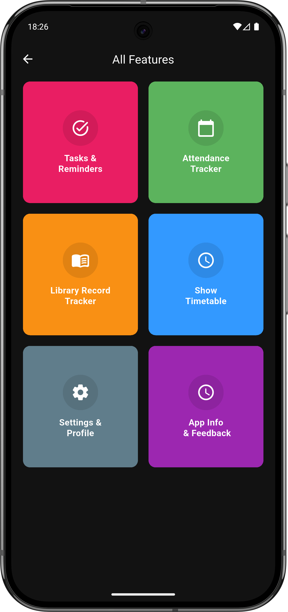

# 🎓 SmartDesk - Your Personal College Companion

SmartDesk is a comprehensive academic productivity application designed to help students streamline their college life. From tracking attendance and managing library books to setting up interactive timetables and catching up on academic events, SmartDesk puts everything you need in one place.

## ✨ Key Features

### 📅 Attendance Tracker
Never fall short of your attendance requirements again.
- **Visual Calendar**: Monthly view with color-coded markers for Present, Absent, Holiday, and Partial attendance.
- **Smart Stats**: Detailed subject-wise analytics with donut charts showing your current percentage.
- **Safe Calculation**: Instantly see how many classes you need to attend to hit the 75% threshold.
- **Next Working Day**: Automatically calculates and displays the next academic working day, accounting for weekends and holidays.

### 🕒 Interactive Timetable
A powerful, visual way to manage your weekly schedule.
- **Visual Timeline Editor**: Tap and drag on a timeline to set class durations (1-3 hours).
- **Day-wise View**: Clean tabbed interface for Monday through Saturday.
- **Conflict Detection**: Prevents overlapping sessions and invalid durations.
- **Quick Edits**: Easily modify or delete time slots as your schedule changes.

### 📚 Library Record Tracker
Keep track of your borrowed books and avoid late fees.
- **Deadline Reminders**: Automated notifications sent 7 days, 3 days, 1 day before, and on the due date.
- **Status Badges**: Visual indicators for "Overdue", "Due Today", or "X Days Left".
- **History Log**: Archive returned books to keep a reading history.
- **Barcode Scanner**: Quickly input Accession Numbers using your phone's camera.

### ✅ Tasks & Reminders
A robust To-Do list built for students.
- **Recurring Tasks**: Set tasks that repeat daily, on specific days, or at custom intervals.
- **One-Time Tasks**: Add deadlines and get reminded before they are due.
- **Priority Sorting**: Overdue and pending tasks are highlighted for immediate attention.

### 📅 Academic Calendar
Stay updated with official college events.
- **Offline Support**: Caches calendar data so you can view it even without internet.
- **Countdown**: Shows exactly how many days are left for upcoming exams, holidays, or semester breaks.
- **Semester Organization**: Automatically groups events by Odd and Even semesters.

### 🎨 Personalization
- **Theme Support**: Fully supports Light, Dark, and System themes.
- **Profile Settings**: Configure your academic joining year to auto-calculate your current year.

---

## 🛠️ Technology Stack

- **Framework**: Flutter (Dart)
- **State Management**: Provider
- **Local Database**: SQLite (`sqflite`) for robust offline data persistence.
- **Notifications**: `flutter_local_notifications` for scheduled and instant alerts.
- **Calendar**: `table_calendar` for the attendance interface.
- **Preferences**: `shared_preferences` for settings and lightweight caching.

---

## 🚀 Getting Started

### Prerequisites
- Flutter SDK installed (Version 3.0.0 or higher recommended)
- Android Studio / VS Code
- Android Device or Emulator

### Installation

1. **Clone the repository**
   ```bash
   git clone https://github.com/imtiyazallam07/smartdesk.git
   ```

2. **Navigate to the project directory**
   ```bash
   cd smartdesk
   ```

3. **Install dependencies**
   ```bash
   flutter pub get
   ```

4. **Run the app**
   ```bash
   flutter run
   ```

---

## 📸 Screenshots

| Home | Timetable | Library Tracker |
|:---:|:---:|:---:|
|  |  |  |

| To-Do List | Academic Calendar | Attendance |
|:---:|:---:|:---:|
|  |  | |

| Curriculum | Calendar | All Features |
|:---:|:---:|:---:|
|  |  | |

